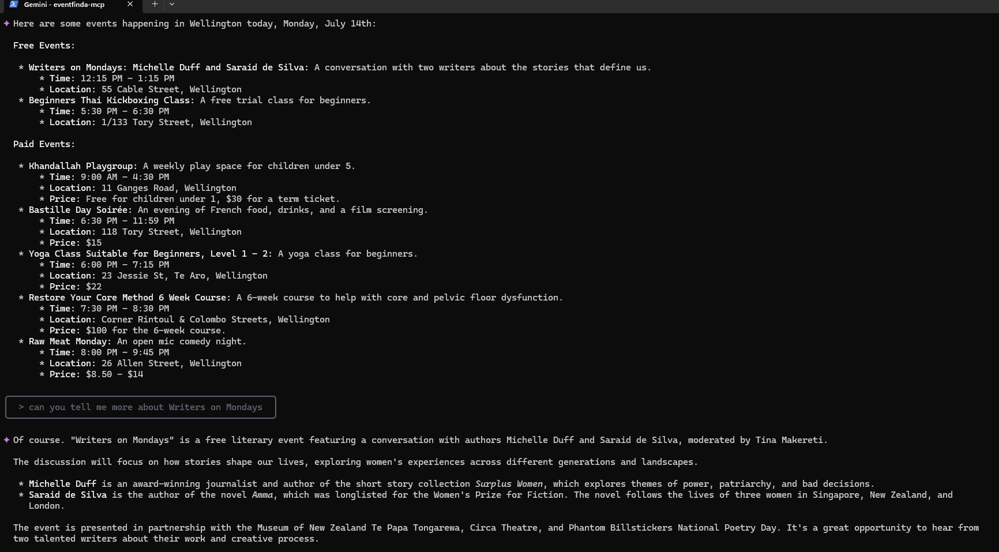

# Eventfinda MCP

This plugin provides access to event data from the Eventfinda API. It allows AI agents to search for events by location and retrieve detailed information including event descriptions, dates, addresses, and ticket information.

## Features

Example prompt to an AI with:

```
Find me events happening in Wellington this week.
```



- Search for events by location
- Get detailed event information including:
  - Event title and description
  - Event URL
  - Date and time information
  - Address/location details
  - Ticket availability and pricing
  - Free event identification

## Setup

### Basic Configuration

Apply API username and password from https://www.eventfinda.co.nz/api/v2/index

To use with Claude Desktop / Cursor / cline, ensure your configuration matches:

```json
{
  "mcpServers": {
    "youtube-transcript": {
      "command": "npx",
      "args": ["-y", "@gabriel3615/eventfinda-mcp"],
      "env": {
        "EVENTFINDA_USERNAME": "USERNAME",
        "EVENTFINDA_PASSWORD": "PASSWORD"
      }
    }
  }
}
```

### Prerequisites

- Node.js (v14 or higher)
- Eventfinda API credentials

### Environment Configuration

Create a `.env` file in the root directory with your Eventfinda API credentials:

```
EVENTFINDA_USERNAME=your_api_username
EVENTFINDA_PASSWORD=your_api_password
```

### Installation

```bash
npm install
```

## Usage

### Starting the MCP

```bash
npm start
```

This starts the MCP server using stdio transport, making it available to AI agents.

### Accessing the Plugin in an AI Agent

Example prompt to an AI agent with access to this plugin:

```
Find me free events happening in Auckland this week.
```

## API Tools

### list_events

Lists events within the next week for a specified location.

**Parameters:**
- `location`: String - The location to search for events in (e.g., "Auckland", "Wellington")

**Response Example:**

```json
[
  {
    "id": 123456,
    "title": "Summer Music Festival",
    "description": "A weekend of live music performances...",
    "url": "https://www.eventfinda.co.nz/2023/summer-music-festival/auckland",
    "datetime_start": "2023-11-25T15:00:00",
    "datetime_end": "2023-11-25T22:00:00",
    "address": "123 Main Street, Auckland CBD, Auckland",
    "is_free": false,
    "ticket_info": [
      {
        "name": "General Admission",
        "price": "25.00",
        "currency": "NZD"
      }
    ]
  },
  {
    "id": 123457,
    "title": "Community Art Exhibition",
    "description": "Local artists showcase their work...",
    "url": "https://www.eventfinda.co.nz/2023/community-art-exhibition/auckland",
    "datetime_start": "2023-11-26T10:00:00",
    "datetime_end": "2023-11-26T16:00:00",
    "address": "Auckland Art Gallery, Auckland CBD",
    "is_free": true,
    "ticket_info": "Free event"
  }
]
```

## Development

### Running in Development Mode

```bash
npm run inspect
```

### Testing the API

You can test the API using the included HTTP request files in the `requests` directory:

```
requests/auth-request.http
```

## Eventfinda API Reference

This plugin uses the Eventfinda API v2. For more information, visit:
https://www.eventfinda.co.nz/api/v2/index

## License

MIT
